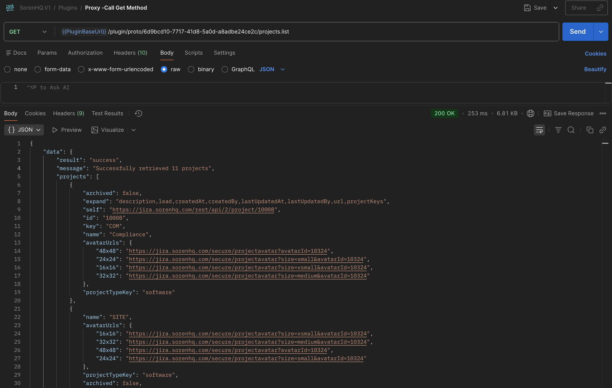

# Jira Integration Plugin

A Soren plugin for integrating with Jira, allowing you to manage projects, create issues, delete issues, and add comments.

## Structure

This plugin follows a clean, modular structure:

```
jira-plugin/
├── actions/
│   ├── issues/
│   │   ├── actions.go      # Issue-related action definitions
│   │   └── handlers.go     # Issue action handlers
│   └── projects/
│       ├── actions.go      # Project-related action definitions
│       └── handlers.go     # Project action handlers
├── client/
│   └── jira_client.go      # Jira API client implementation
├── credentials/
│   └── credentials.go      # Credentials storage and management
├── handlers.go             # Shared handlers (onboarding, etc.)
├── plugin.go              # Main plugin initialization
├── go.mod                 # Go module definition
└── env.plugin             # Environment configuration
```

## Actions

### Projects
- **projects.list** - List all projects in your Jira instance

### Issues
- **issues.create** - Create a new issue in Jira
- **issues.delete** - Delete an issue by key or ID
- **issues.comment** - Add a comment to an issue

## Features

- **Multi-tenant support**: Each space (entityId) can have its own Jira credentials
- **Dynamic fields**: Support for additional Jira fields through `additionalFields` parameter
- **Synchronous responses**: Quick operations respond directly without async job pattern
- **Error handling**: User-friendly error messages from Jira API responses

## Development

1. Install dependencies:
   ```bash
   go mod tidy
   ```

2. Build the plugin:
   ```bash
   go build -o jira-plugin .
   ```

3. Run the plugin:
   ```bash
   go run .
   ```

## Configuration

The plugin requires the following environment variables (set in `env.plugin`):
- `AGENT_URI` - NATS agent URI
- `PLUGIN_ID` - Plugin identifier
- `AGENT_CRED` - NATS credentials
- `SOREN_AUTH_KEY` - Authentication key for event logging
- `SOREN_EVENT_CHANNEL` - NATS channel for events

### Set up `env.plugin`

`env.plugin` is ignored by git. Create it manually with values for your environment:

```dotenv
AGENT_URI=127.0.0.1:5222
PLUGIN_ID=bin.*.<plugin-uuid>
AGENT_CRED=<nats_creds_string>
SOREN_AUTH_KEY=<auth_key>
SOREN_EVENT_CHANNEL=<event_channel>
```

Notes:
- `PLUGIN_ID` must start with `bin.*.` for internal plugins.
- The plugin loads this file at startup: `godotenv.Load("./env.plugin")`.

### Getting env values

You can fetch the plugin credentials from the platform API:

```
GET {{PluginBaseUrl}}/platform/node/cred?page=1&per_page=10&search=
```

Example (replace base URL and token/header as needed):

```bash
curl -H "Authorization: Bearer <token>" \
  "{{PluginBaseUrl}}/platform/node/cred?page=1&per_page=10&search="
```

Use the response fields to populate `env.plugin`:
- `AGENT_URI`
- `PLUGIN_ID`
- `AGENT_CRED`
- `SOREN_AUTH_KEY`
- `SOREN_EVENT_CHANNEL`

### Verify the plugin is running

You can confirm the plugin is up and registered by hitting the proto endpoints:

```
GET {{PluginBaseUrl}}/plugin/proto/6d9bcd10-7717-41d8-5a0d-a8adbe24ce2c/@intro
GET {{PluginBaseUrl}}/plugin/proto/6d9bcd10-7717-41d8-5a0d-a8adbe24ce2c/@actions
```

### Example: projects.list response



## Onboarding

Users must complete onboarding by providing:
- Jira Instance URL
- Email address
- API Token (Cloud: https://id.atlassian.com/manage-profile/security/api-tokens, self-hosted: https://jira.sorenhq.com/secure/ViewProfile.jspa?selectedTab=com.atlassian.pats.pats-plugin:jira-user-personal-access-tokens)

Credentials are stored per space (entityId) for multi-tenant support.

## Sample Requests (HTTP)

You can call the plugin directly via the proto endpoint:

```
GET {{PluginBaseUrl}}/plugin/proto/6d9bcd10-7717-41d8-5a0d-a8adbe24ce2c/projects.list
```

Issue actions use `POST` with a JSON body under `body`:

```
POST {{PluginBaseUrl}}/plugin/proto/6d9bcd10-7717-41d8-5a0d-a8adbe24ce2c/issues.create
{
  "body": {
    "projectKey": "PROJ",
    "issueType": "Task",
    "summary": "Test from HTTP",
    "description": "Created via request",
    "additionalFields": {
      "dueDate": "2024-12-31"
    }
  }
}
```

Note: `dueDate` is required and must be provided inside `additionalFields`.

Example: add a comment:

```
POST {{PluginBaseUrl}}/plugin/proto/6d9bcd10-7717-41d8-5a0d-a8adbe24ce2c/issues.comment
{
  "body": {
    "issueKey": "COM-69",
    "commentBody": "This is a comment"
  }
}
```
